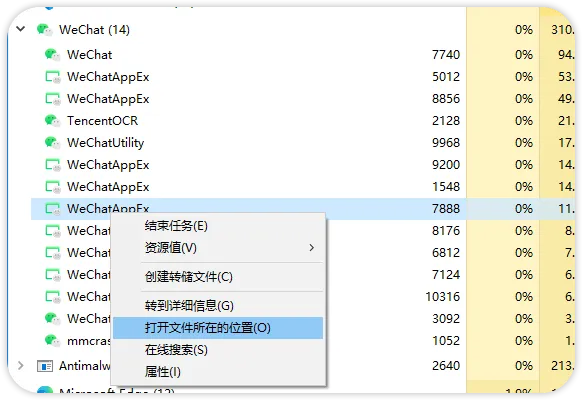
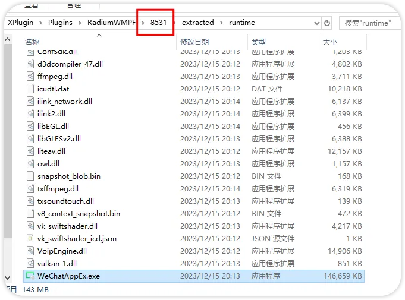
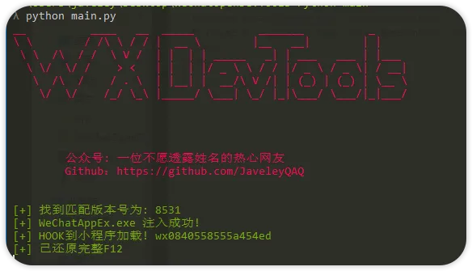
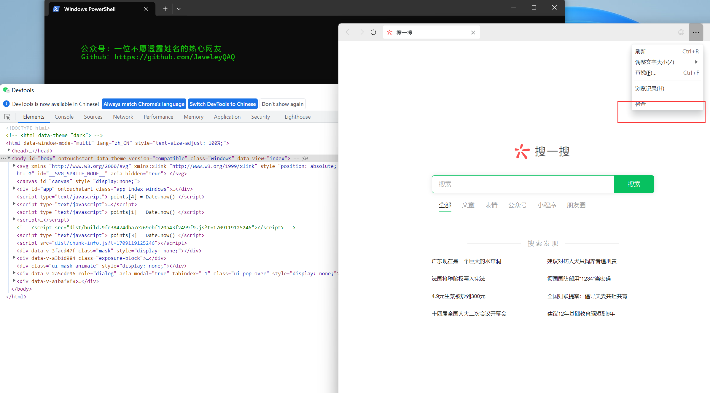
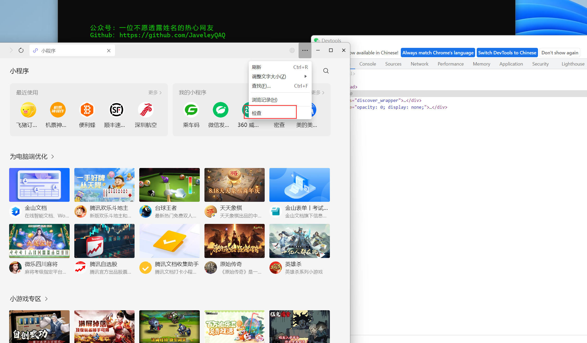

### **注意本库只能作为学习用途, 造成的任何问题与本库开发者无关, 如侵犯到你的权益，请联系删除。**

### **注意本库只能作为学习用途, 造成的任何问题与本库开发者无关, 如侵犯到你的权益，请联系删除。**

### **注意本库只能作为学习用途, 造成的任何问题与本库开发者无关, 如侵犯到你的权益，请联系删除。**

---


## 支持版本

> 感谢志远大佬的WeChatOpenDevTool开源 代码只是把node改用python3重写，简单实现了一些自动化问题，重要代码都是原作者的。

| Windows 微信版本 | 小程序版本 | 是否为最新版 |
| ---------------- | ---------- | ------------ |
| 3.9.10.19_x64    | 9129_x64   | ✅           |
| 3.9.10.19_x64    | 9115_x64   | ✅           |
| 3.9.10.19_x64    | 8555_x64   | ✅           |
| 3.9.10.19_x64    | 9105_x64   | ✅           |
| 3.9.9.43_x64     | 8555_x64   | ❌           |
| 3.9.9.43_x64     | 9079_x64   | ❌           |
| 3.9.8.25_x64     | 8531_x64   | ❌           |
| 3.9.8.25_x64     | 8529_x64   | ❌           |
| 3.9.8.25_x64     | 8519_x64   | ❌           |
| 3.9.8.25_x64     | 8501_x64   | ❌           |
| 3.9.8.25_x64     | 8461_x64   | ❌           |
| 3.9.8.25_x64     | 8447_x64   | ❌           |

---


| Mac x64微信版本              | 是否为最新版   | x             
| ----------------            | ------------ | ------------ 
| MacWechat/3.8.7(0x13080712) | ✅           |用前阅读 [3. 常见问题](#%E5%B8%B8%E8%A7%81%E9%97%AE%E9%A2%98)             


## 如何查看当前运行版本？
### windows
  





### mac
```bash
ps aux | grep 'WeChatAppEx' |  grep -v 'grep' | grep  "wmpf-mojo-handle" 
```


## 目录

[1. 开启小程序F12](#%E9%A3%9F%E7%94%A8%E6%96%B9%E6%B3%95)

[2. 开启微信内置浏览器F12](#%E5%BC%80%E5%90%AF%E5%BE%AE%E4%BF%A1%E5%86%85%E7%BD%AE%E6%B5%8F%E8%A7%88%E5%99%A8F12)

[3. 常见问题](#%E5%B8%B8%E8%A7%81%E9%97%AE%E9%A2%98)

## 食用方法

### 开启小程序F12

> ~~只支持windows版本微信~~，运行前先启动微信运行前先启动微信（建议小号,别被封了。。。)

1. 安装python3版本
2. 下载WeChatOpenDevTools-Python或直接下载编译好的exe
   [WeChatOpenDevTools_64.exe](https://github.com/JaveleyQAQ/WeChatOpenDevTools-Python/releases/)

安装依赖

```
pip3  install -r requirements.txt
```

运行✅

```
python main.py -x
```




---

### 开启微信内置浏览器F12

```python
python  main.py -c
```






---

### 常见问题

* 无法修改中文
  
  - yes
* 提示找不到版本或微信未运行❌
  
  - 1. 请先看支持的微信版本和小程序版本
       - 如果还有问题看：[微信版本和小程序版本都是符合要求的，但是仍然显示“未找到匹配版本的微信进程或微信未运行”](https://github.com/JaveleyQAQ/WeChatOpenDevTools-Python/issues/38)
    2. **如果微信版本相同小程序版本不同，就删除小程序版本目录并重启微信，直到刷出支持的小程序版本目录**
    3. 最后回到上级目录，设置文件夹权限为只读，这样就能一直保持小程序版本一致
       [image](https://github.com/JaveleyQAQ/WeChatOpenDevTools-Python/assets/132129852/c2b793c3-6d81-424e-a167-3b1e584cef6f)
* 怎么回退版本？
  
  - https://weixin.qq.com/cgi-bin/readtemplate?lang=zh_CN&t=weixin_faq_list&head=true
  - https://github.com/tom-snow/wechat-windows-versions/releases


* mac版本闪退
  -  ~~[macOS版本](https://github.com/JaveleyQAQ/WeChatOpenDevTools-Python/releases/)不能和windows版本一样随时hook小程序修改F12，只能先加载小程序后再hook（必须是有小程序缓存了，不然会闪退）~~
  - 可以先启动多个需要调试的小程序后再运行软件然后再刷新小程序
  
## Star History

[](https://star-history.com/#javeleyqaq/WeChatOpenDevTools-Python&Date)

