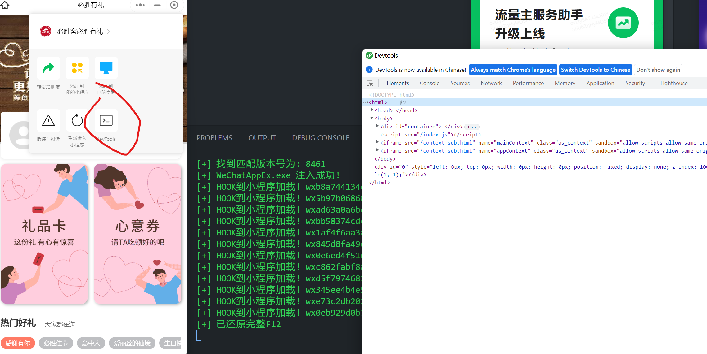
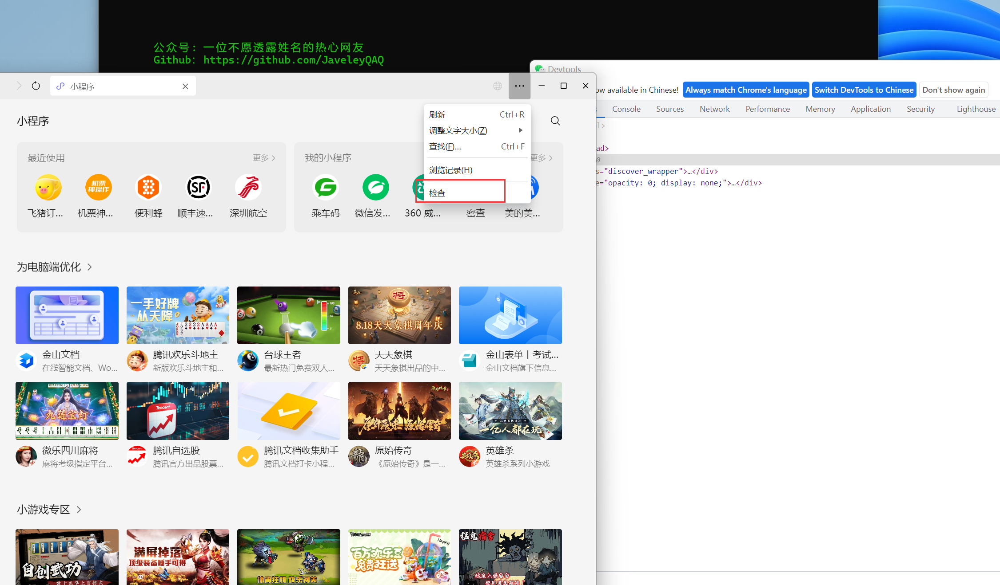

### **注意本库只能作为学习用途, 造成的任何问题与本库开发者无关, 如侵犯到你的权益，请联系删除。**

### **注意本库只能作为学习用途, 造成的任何问题与本库开发者无关, 如侵犯到你的权益，请联系删除。**

### **注意本库只能作为学习用途, 造成的任何问题与本库开发者无关, 如侵犯到你的权益，请联系删除。**

---

# 目录
[1. 支持版本列表](#%E5%A6%82%E4%BD%95%E6%9F%A5%E7%9C%8B%E5%BD%93%E5%89%8D%E8%BF%90%E8%A1%8C%E7%89%88%E6%9C%AC)

[2. 如何查看当前运行版本?](#%E5%A6%82%E4%BD%95%E6%9F%A5%E7%9C%8B%E5%BD%93%E5%89%8D%E8%BF%90%E8%A1%8C%E7%89%88%E6%9C%AC)
  - [windows](#windows)
  - [mac](#mac)
    
[3. 食用方法](#%E9%A3%9F%E7%94%A8%E6%96%B9%E6%B3%95)

 - [开启小程序F12](#%E9%A3%9F%E7%94%A8%E6%96%B9%E6%B3%95)

 - [开启微信内置浏览器F12](#%E5%BC%80%E5%90%AF%E5%BE%AE%E4%BF%A1%E5%86%85%E7%BD%AE%E6%B5%8F%E8%A7%88%E5%99%A8F12)

[4. 常见问题](#%E5%B8%B8%E8%A7%81%E9%97%AE%E9%A2%98)


---


## 支持版本列表

> 感谢志远大佬的WeChatOpenDevTool开源 代码只是把node改用python3重写，简单实现了一些自动化问题，重要代码都是原作者的。

### Windows 微信 3.x

| Windows 微信版本 | 小程序版本 | 是否为最新版 |
| ---------------- | ---------- | ------------ |
|                 | 11275_x64   | ✅           |
|                 | 11253_x64   | ✅           |
|                 | 11205_x64   | ✅           |
|                 | 11159_x64   | ✅           |
| 3.9.10.19_x64    | 9129_x64   | ✅           |
| 3.9.10.19_x64    | 9115_x64   | ✅           |
| 3.9.10.19_x64    | 8555_x64   | ❌           |
| 3.9.10.19_x64    | 9105_x64   | ❌           |
| 3.9.9.43_x64     | 8555_x64   | ❌           |
| 3.9.9.43_x64     | 9079_x64   | ❌           |
| 3.9.8.25_x64     | 8531_x64   | ❌           |
| 3.9.8.25_x64     | 8529_x64   | ❌           |
| 3.9.8.25_x64     | 8519_x64   | ❌           |
| 3.9.8.25_x64     | 8501_x64   | ❌           |
| 3.9.8.25_x64     | 8461_x64   | ❌           |
| 3.9.8.25_x64     | 8447_x64   | ❌           |

---

### Windows 微信 4.x / WMPF

> 微信 4 已切换为 Remote Debug/CDP 调试链路，不再沿用旧版内置 F12 补丁。
>
> 实现来源说明：
> 微信 4 兼容逻辑主要参考了 [`evi0s/WMPFDebugger`](https://github.com/evi0s/WMPFDebugger) 的公开实现、适配说明与相关 issue 讨论；本仓库在此基础上改造成了 Python 主控 + Frida 注入 + 本地 Node bridge 的版本。

已内置地址配置的 WMPF 版本：

`11581` `11633` `13331` `13341` `13487` `13639` `13655` `13871` `13909` `14161` `14199` `14315` `16133` `16203` `16389` `16467` `16771` `16815` `16965` `17037` `17071` `17127` `18055` `18151` `18787` `18891` `18955` `19027` `19201` `19339` `19459`

如果当前 WMPF 版本不在上面的列表里，`-x` 会提示你缺少 `configs/wx4/addresses.<version>.json`。

---


| Mac x64微信版本              | 是否为最新版   | x             
| ----------------            | ------------ | ------------ 
| MacWechat/3.8.8(0x13080811) | ✅           | 源码运行            
| MacWechat/3.8.8(0x13080812) | ✅           | 源码运行   


## 如何查看当前运行版本？
### windows

微信 3.x 可以看关于页或小程序目录版本。

微信 4.x 可以在任务管理器里找到 `WeChatAppEx.exe`，右键“打开文件所在的位置”，查看路径里 `RadiumWMPF` 和 `extracted` 之间的数字，例如：

```text
...\RadiumWMPF\19201\extracted\...
```
  


### mac
```bash
ps aux | grep 'WeChatAppEx' |  grep -v 'grep' | grep  "wmpf-mojo-handle" 
```


## 食用方法

### 开启小程序F12

> 现在同时支持微信 3.x 和微信 4.x，但两者的调试方式不同。运行前先启动微信（建议小号，自担风险）。

1. 安装python3版本
2. 如果要调试微信 4.x，请额外安装 Node.js（建议 20+）
3. 下载WeChatOpenDevTools-Python或直接下载编译好的exe
   [WeChatOpenDevTools_64.exe](https://github.com/JaveleyQAQ/WeChatOpenDevTools-Python/releases/)

安装依赖

```
pip3  install -r requirements.txt
npm install
```

> 如果你只调试微信 3.x，可以跳过 `npm install`。

运行✅

```
python main.py -x
```

微信 3.x：

- 仍然沿用原来的注入逻辑，直接恢复小程序里的调试能力。

微信 4.x：

- 工具会自动识别 WMPF 运行时并切换到 Remote Debug 模式。
- 启动后会输出一个 `devtools://devtools/bundled/inspector.html?ws=127.0.0.1:<port>` 链接。
- 先启动要调试的小程序，等终端出现“微信4小程序调试客户端已连接”。
- 再用 Chrome / Edge 之类的 Chromium 浏览器打开这个链接。
- 可以通过下面两个参数改端口：

```bash
python main.py -x --debug-port 9421 --cdp-port 62000
```




---

### 开启微信内置浏览器F12

```python
python  main.py -c
```

> 这条路径目前仍然是旧版实现，微信 4.x 暂未适配。





---

### 常见问题

* 无法修改中文
  
  - yes
* 提示找不到版本或微信未运行❌
  
  - 1. 请先看支持的微信版本和小程序版本
       - 如果还有问题看：[微信版本和小程序版本都是符合要求的，但是仍然显示“未找到匹配版本的微信进程或微信未运行”](https://github.com/JaveleyQAQ/WeChatOpenDevTools-Python/issues/38)
    2. **如果微信版本相同小程序版本不同，就删除小程序版本目录并重启微信，直到刷出支持的小程序版本目录**
    3. 最后回到上级目录，设置文件夹权限为只读，这样就能一直保持小程序版本一致
       [image](https://github.com/JaveleyQAQ/WeChatOpenDevTools-Python/assets/132129852/c2b793c3-6d81-424e-a167-3b1e584cef6f)
* 微信4启动后没有出现内置 F12
  
  - 这是正常现象。微信 4 走的是浏览器 DevTools 远程调试，不是旧版的小程序内置 F12。
  - 请看终端输出里的 `devtools://...` 链接，用 Chromium 浏览器打开。
* 微信4小程序一闪而过 / 调试连接立刻断开
  
  - 先确认顺序：先开小程序，等终端出现“微信4小程序调试客户端已连接”，再打开浏览器 DevTools。
  - 看终端里的 `[frida] [hook] scene: ...` 和 `hook scene condition -> 1101`。
  - 如果没有看到 `scene` 日志，说明这次流程没有命中小程序加载 hook。
  - 如果看到了 `scene`，但没有 `1101`，说明当前小程序入口 scene 不在已适配列表里。
* 微信4提示缺少配置
  
  - 终端会打印当前 WMPF 版本号。
  - 对应补充 `configs/wx4/addresses.<version>.json` 后再重试。
* 怎么回退版本？
  
  - https://weixin.qq.com/cgi-bin/readtemplate?lang=zh_CN&t=weixin_faq_list&head=true
  - https://github.com/tom-snow/wechat-windows-versions/releases


* mac版本闪退
  -  ~~[macOS版本](https://github.com/JaveleyQAQ/WeChatOpenDevTools-Python/releases/)不能和windows版本一样随时hook小程序修改F12，只能先加载小程序后再hook（必须是有小程序缓存了，不然会闪退）~~
  - 可以先启动多个需要调试的小程序后再运行软件然后再刷新小程序
* mac版本提示 [ Error: Unable to access process with pid xxx from the current user account](https://github.com/JaveleyQAQ/WeChatOpenDevTools-Python/issues/49)
## Star History

[](https://star-history.com/#javeleyqaq/WeChatOpenDevTools-Python&Date)

